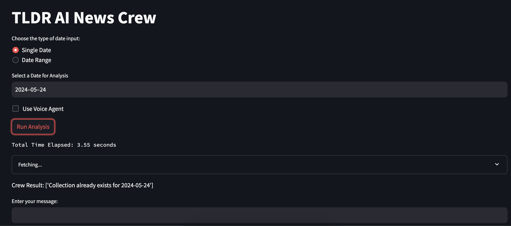

## TLDR-AI-News-Crew

AI news going a bit faster to catch up? TLDR (tldr.tech) got it. Even, tldr's daily AI news is also overwhelming? The crew here got you. It's a learning repo with CrewAI to test agent capabilities, some features are just tested for fun and not for potential use.


### Installation

```
pip install -r requirements.txt
```
add api keys from the .env.example. Most cases should be fine with openai key, but some cases uses groq (could be optional, and may need to change llm as openai in the code) -> in future, replace all with ollama llama3 (currently in code, but not properly tested, hence not in the instruction). Same with Elevenlabs, but it gives certain feature that are not available in OpenAI TTS atm.


### Usage

```
streamlit run main.py 
```
 - Give a date or range of date input.
 - it crawls all TLDR ai data 
 - Use voice agent / text agent
 - Start chatting

 Screenshot:



### TODO

1. Change prompt to provide more like Q*A bot (refine answer)
2. Get personalized/preferred input news
3. add option voice agent or just text agent
4. add image capabilities
5. Extension of other TLDR news
6. Proper speech data handle

Inspired from some examples:
- Based upon [Crew Examples](https://mer.vin/2024/02/crewai-rag-using-tools/)
- [Streamlit courtesy](https://github.com/AbubakrChan/crewai-streamlit-UI-business-product-launch/)